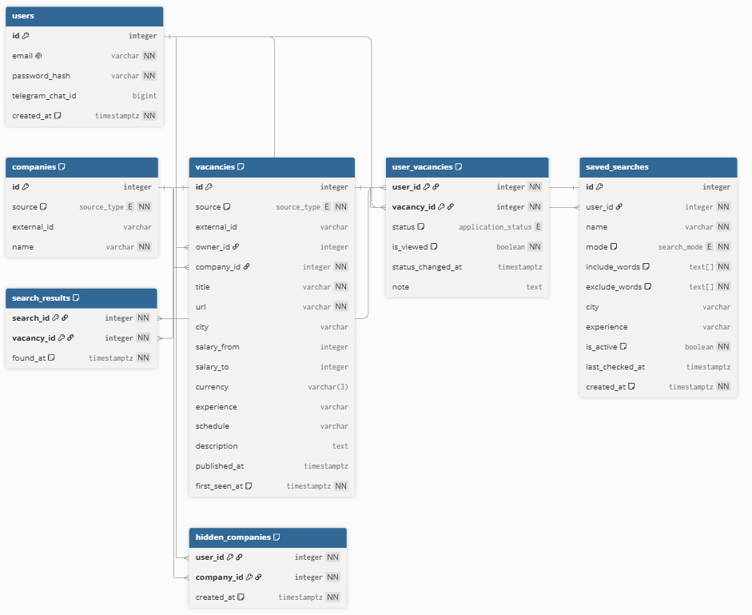

# Описание проекта, мысли и идеи.

## Проблема
Проект решает проблему поиска вакансий инженеру-разработчику в нынешнее время. Стажировки и вакансии разбросаны по hh.ru, сервисам крупных компаний и каналам в соц. сетях, что затрудняет поиск. Вакансии с hh.ru будут подтягиваться по открытому API, а для иных вакансий предусмотрена функция ручного добавления. На hh.ru нет удобного исключения по словам, скрытия компаний и учета откликов со статусами, эти проблемы решает мое приложение. Так же для удобства будут добавлены уведомления о новом, чтобы каждый раз не искать все руками.

## Стек
Для работы над проектом выбраны следующие технологии:
- JavaScript - основной язык. Сейчас чаще используют и требуют TypeScript, но я выбрал JS потому что текущий проект уже использует технологии с которыми я едва знаком. Моим решением является разработка на JavaScript с дальнейшим переходом на TypeScript
- Node.js - в основе бэкенда используется Node.js и фреймворк Express.js. Разработка бэкенда на Node обусловлена тем, что мне нравится экосистема JavaScript. Решил начать с того, что уже затрагивал и в чем немного разбираюсь.
- PostgreSQL - в качестве базы данных используется реляционная СУБД. Этот выбор обусловлен большим количеством связей, большая часть из них многие-ко-многим, важна уникальность и целостность. Выбор PostgreSQL - новой для меня бд, обусловлен тем, что я хочу идти в ногу с технологиями, в качестве реляционной бд она используется очень часто. 
- Взаимодействие с бд - для начала я буду использовать голый pg, для лучшего понимания работы SQL. В дальнейшем планирую перейти на ORM, вероятнее всего Prisma для Node.js. 

## MVP

### Источники
- hh.ru через API
- ручное добавление (личные вакансии, видит только владелец)
- источники - отдельные модули; Хабр Карьера подключается позже

### Поиск
- сохраненные поиски
- слова-чипы (ввод+Enter), один режим на поиск: все слова (И) или любое (ИЛИ)
- чипы-исключения (НЕ)
- фоновая проверка сохраненных поисков на новые вакансии

### Лента и вакансии
- на главной - новые, еще не просмотренные вакансии по сохраненным поискам
- одна вакансия, найденная несколькими поисками, показывается один раз
- максимум информации внутри трекера; полное описание загружается при открытии и сохраняется

### Отбор и отклики
- автоматический признак "новое/просмотрено"
- статусы, которые выставляет пользователь: интересно -> откликнулся -> тестовое -> собес -> оффер / отказали / отказался, плюс "пропускаю"
- скрытие компании (в MVP - только компаний с hh)
- одна заметка на вакансию

### Ручное добавление
- обязательны: компания, должность, ссылка
- остальное по желанию, можно дополнить позже

### Уведомления
- только Telegram

### Пользователи
- пока один, но схема с расчетом на многих; нужен вход, потому что проект будет в интернете.

### Что не входит
Рекомендации похожих вакансий, смешивание И/ИЛИ в одном поиске, выбор канала уведомления, публичные ручные вакансии, история заметок, парсинг сайтов компаний.

## Диаграмма БД

[Схема в DBML](schema.dbml)

## Открытые вопросы
- Фронтенд
- Способ авторизации
- Деплой